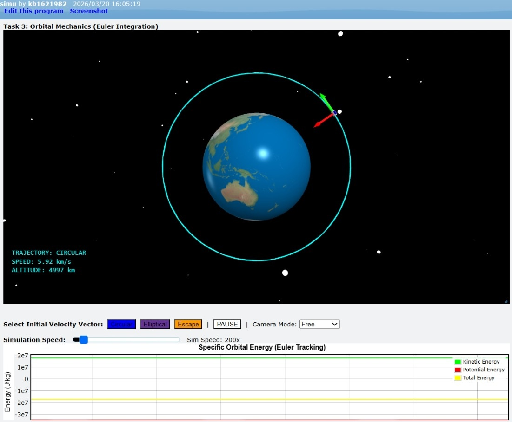
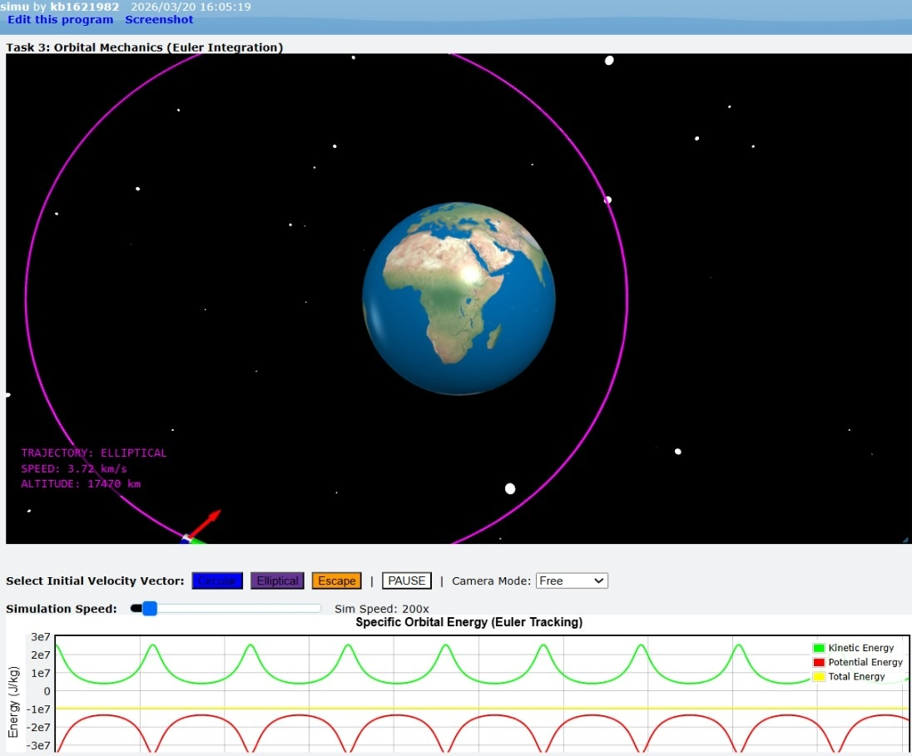
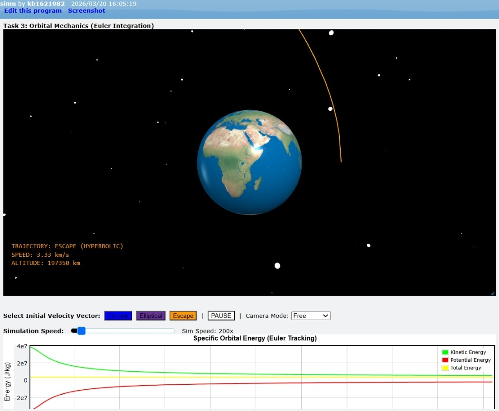

# 3D Orbital Mechanics Simulation
**Grade 11 Unified Physics Project | St. John Baptist De La Salle**

This project simulates satellite trajectories around Earth using **Python (VPython)** and numerical integration (**Euler's Method**). It was developed to demonstrate the relationship between centripetal force, gravitational potential, and kinetic energy in various orbital states.

---

## 🚀 Quick Links
* **[Live Presentation Slides](https://www.overleaf.com/read/cbhzfkgmqkhh#30c073)**
* **[Final Project Essay (PDF)](Project_Essay.pdf)**

---

## 🛰️ Project Overview
The simulation calculates the instantaneous acceleration of a satellite using Newton's Law of Universal Gravitation:
$$a = - \frac{GM}{r^2}$$
Instead of using static geometric formulas, we update the velocity and position of the satellite frame-by-frame (Numerical Integration), allowing for dynamic orbit transitions.

### Supported Orbit Types:
1. **Circular:** Velocity ($v$) equals $\sqrt{GM/r}$.
2. **Elliptical:** Velocity is between circular and escape velocity.
3. **Escape:** Velocity exceeds $\sqrt{2GM/r}$.

---

## 🛠️ Installation & Usage
1. Ensure you have Python installed.
2. Install the VPython library: `pip install vpython`
3. Run the simulation: `python satellite_simulation.py`

---

## 👥 Contributors (Groups 3 & 8)
* Amanuel Wondesen, Dawit Mulugeta, Hizkel Melese, Kaleb Million, Kidus Dawit, Mikiyas Mesfin, Muhamed Jemal, Nawolin Tesema, Negedeyesus Zewdu, Wako Gutu, Yonatan Alemu, Yoseph Kiflu.

---

## 📄 Visual Evidence
| Circular Orbit | Elliptical Orbit | Escape Trajectory |
| :---: | :---: | :---: |
|  |  |  |
